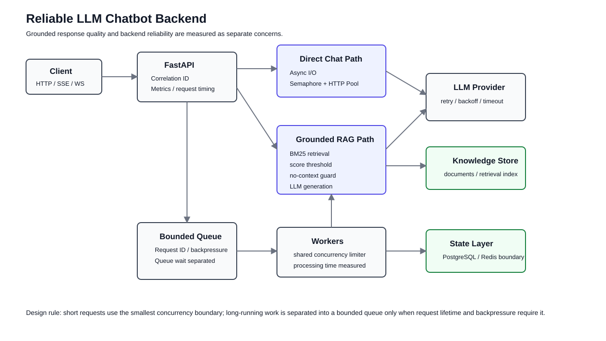
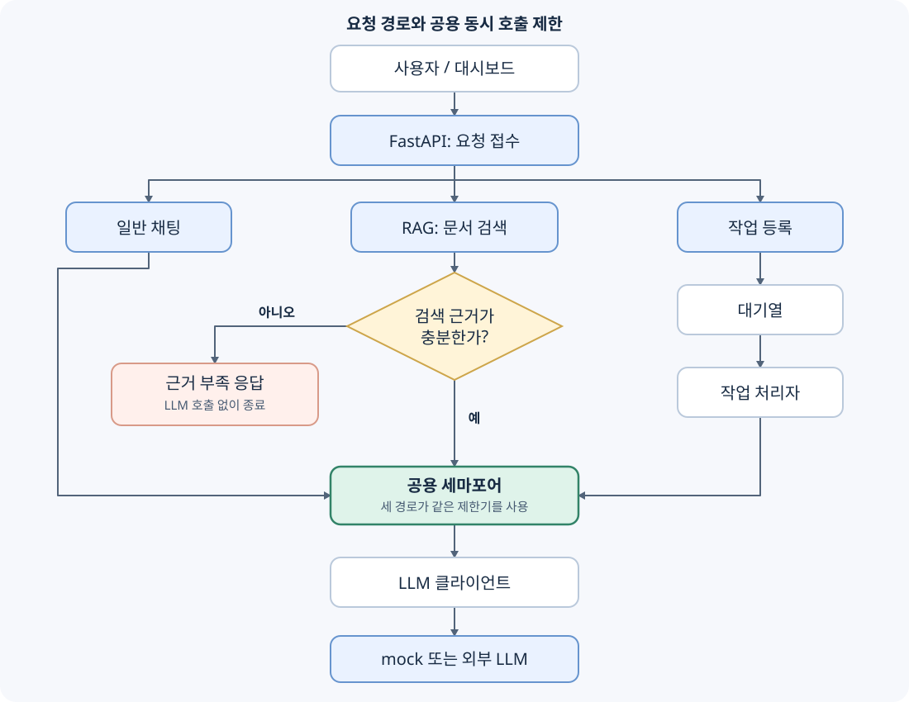

<div align="center">

# Reliable LLM Chatbot Backend

외부 LLM 호출에서 발생하는 긴 네트워크 대기와 동시 요청 증가를 안정적으로 처리하기 위해 만든 FastAPI 백엔드입니다.


</div>

---

## 1. 프로젝트 핵심

외부 LLM 호출은 CPU 계산보다 **네트워크 응답을 기다리는 시간이 긴 I/O 작업**입니다.

```text
동시 요청 증가
  ↓
외부 LLM 대기 증가
  ↓
처리 중 요청 증가
  ↓
p95/p99 지연시간 , 429 , 제한시간 초과 증가
  ↓
동시 호출 제한과 과부하 제어 필요
```

이를 위해 다음 기능을 구현했습니다.

- I/O 대기 중 다른 요청을 처리하기 위한 비동기 처리
- 외부 LLM 과부하를 막기 위한 세마포어
- 긴 작업을 관리하기 위한 제한된 대기열
- HTTP 연결 재사용을 위한 연결 풀
- 일시적인 장애에 대한 제한된 재시도
- 폴링 / SSE / WebSocket 결과 전달
- RAG 검색 근거가 부족할 때 응답 차단
- 처리량, p95/p99 지연시간, 오류율, 대기시간 측정

---

## 2. 왜 비동기 처리를 사용했는가

```text
요청
  ↓
외부 LLM 호출
  ↓
네트워크 응답 대기
  ↓
응답 반환
```

LLM 호출을 기다리는 동안 이벤트 루프가 다른 요청을 처리할 수 있도록 `async/await`를 사용했습니다.

중요한 점은 **비동기 처리가 LLM 한 번의 생성 시간을 줄여주는 것은 아니라는 점**입니다. 같은 시간 동안 여러 I/O 대기 요청을 효율적으로 관리하는 것이 목적입니다.

---

## 3. 왜 세마포어가 필요한가

비동기로 많은 요청을 받을 수 있다고 해서 외부 LLM에도 모두 동시에 보내면 안 됩니다.

```text
서버가 받은 동시 요청 수
≠
외부 LLM에 동시에 보내는 요청 수
```

`asyncio.Semaphore`로 외부 LLM 동시 호출 수를 제한합니다.

> 비동기 처리는 동시 요청을 효율적으로 받을 수 있게 하지만, 외부 API에 요청이 한꺼번에 몰릴 수 있습니다. 그래서 세마포어로 외부 LLM 동시 호출 수를 별도로 제한했습니다.

---

## 4. 세마포어와 대기열의 차이

### 세마포어
동시에 실행할 수 있는 작업 수를 제한합니다.

### 대기열
기다리는 작업의 순서와 상태까지 관리합니다.

```text
짧은 요청
→ 동시 호출 수만 제한
→ 세마포어

긴 작업
→ 대기 건수 / 대기시간 / 상태 관리 필요
→ 제한된 대기열 + 작업 처리자
```

대기열이 가득 차면 메모리를 계속 늘리지 않고 HTTP 429로 추가 요청을 거절합니다.

대기열의 목적은 요청을 빠르게 만드는 것이 아니라 **과부하 상태를 통제하는 것**입니다.

---

## 5. RAG에서 근거 없는 응답을 어떻게 줄였는가

```text
질문
  ↓
BM25 문서 검색
  ↓
최고 검색 점수 확인
  ↓
기준 이상 → 문서를 근거로 LLM 호출
기준 미만 → 근거 부족 응답
```

현재 기본 검색 점수 기준은 `0.55`입니다.

검색 근거가 부족한데도 LLM을 호출해 그럴듯한 답을 생성하는 것을 줄이기 위한 장치입니다.

---

## 6. 전체 구조



```text
사용자 요청
  ↓
FastAPI
  ↓
요청 추적 ID
  ├─ 일반 대화
  │    ↓
  │  세마포어
  │    ↓
  │  HTTP 연결 풀
  │    ↓
  │  외부 LLM
  │
  ├─ 문서 기반 대화
  │    ↓
  │  BM25 검색
  │    ↓
  │  검색 점수 확인
  │    ↓
  │  근거 기반 LLM 호출
  │
  └─ 긴 작업
       ↓
     제한된 대기열
       ↓
     작업 처리자
       ↓
  폴링 / SSE / WebSocket
```

---

## 7. HTTP 연결 재사용

프로세스가 실행되는 동안 하나의 `httpx.AsyncClient`를 재사용합니다.

```text
요청마다 새 연결
→ TCP/TLS 연결 설정 반복

공유 연결 풀
→ Keep-Alive 연결 재사용
```

연결 풀도 무조건 크게 잡지 않습니다. 외부 LLM 동시 호출 제한과 함께 결정해야 합니다.

---

## 8. 재시도 기준

재시도 대상:

- 제한시간 초과
- 네트워크 오류
- HTTP 429
- HTTP 5xx

재시도하지 않는 오류:

- 잘못된 요청
- 인증 오류
- 입력값 검증 오류

재시도 간격은 점차 늘리고 작은 무작위 지연을 추가합니다. 무제한 재시도는 장애 상황에서 요청을 더 늘릴 수 있으므로 횟수를 제한합니다.

---

## 9. 폴링 / SSE / WebSocket 선택 기준

### 폴링
구현은 단순하지만 완료되지 않은 상태에서도 반복 요청이 발생합니다.

### SSE
서버 → 클라이언트 단방향 전달에 적합합니다. LLM 토큰이나 작업 상태 전달에서는 먼저 검토할 수 있습니다.

### WebSocket
양방향 실시간 통신이 필요할 때 사용합니다. 연결 상태와 여러 서버에서의 연결 관리가 더 복잡합니다.

```text
단방향 상태와 토큰 전달 → SSE 우선 검토
양방향 실시간 통신 → WebSocket 검토
```

---

## 10. 멱등성과 경쟁 상태

현재 실험용 멱등성 저장소는 메모리 기반입니다.

```text
요청 A: 키 조회 → 없음
요청 B: 키 조회 → 없음
요청 A: 처리
요청 B: 처리
```

동시에 같은 키가 들어오면 중복 실행 가능성이 남아 있습니다.

여러 서버로 확장할 경우 다음 방법을 비교할 수 있습니다.

- DB 유일성 제약조건
- Redis `SET NX`
- 멱등성 기록 테이블
- 동일 처리 중 요청 공유

동시성 문제가 있다고 분산 락부터 사용하는 것이 아니라 **더 작은 원자 연산이나 DB 제약조건으로 해결할 수 있는지 먼저 확인**합니다.

---

## 11. PostgreSQL / Redis / Kafka 역할 구분

```text
PostgreSQL
→ 영구 데이터와 트랜잭션

Redis
→ 여러 서버가 공유하는 빠른 상태 / 분산 조정

Kafka
→ 이벤트 저장과 전달 / 여러 소비자 분리 / 재처리
```

각 기술을 모든 프로젝트에 넣는 대신 해결해야 할 문제가 있을 때 사용합니다.

---

## 12. 성능 검증

```text
기준 상태
  ↓
가설
  ↓
한 가지 변경
  ↓
같은 부하로 다시 실행
  ↓
원본 결과 저장
  ↓
처리량 / p50 / p95 / p99 / 오류율 / 대기시간 비교
```

측정하지 않은 수치를 성능 개선으로 적지 않습니다.

---

## 13. 테스트

환경변수 설정부터 실제 서버 실행, 기능별 검증까지는 [로컬 실행과 검증 안내](docs/14_local_verification.md)를 따릅니다.

```text
test_smoke.py
→ 비동기 LLM 호출

test_retrieval.py
→ 문서 검색과 검색 점수 기준

test_retry.py
→ 재시도 횟수와 재시도하지 않는 오류
```

GitHub Actions:

```bash
python -m compileall -q app tests benchmarks
pytest -q
```

---

## 14. 현재 한계

1. 작업 상태가 프로세스 메모리에 있어 재시작 시 사라질 수 있습니다.
2. 메모리 기반 멱등성은 동시에 들어온 같은 요청을 완전히 원자적으로 차단하지 못합니다.
3. BM25 문서 저장소는 단일 프로세스 실험용입니다.
4. PostgreSQL 모델이 모든 API 경로와 완전히 연결된 것은 아닙니다.
5. Redis와 Kafka는 역할 비교를 위한 확장 지점이며 모든 요청 경로가 사용하지는 않습니다.
6. 실제 LLM 제공자의 요청 제한과 토큰 전송 특성은 별도 측정이 필요합니다.

---

## 설계 원칙

> **문제를 재현하고, 확인할 지표를 먼저 정하고, 가장 작은 해결책부터 적용한 뒤, 같은 조건에서 다시 측정합니다.**

이 프로젝트에서는 한 요청의 생성 시간을 줄였다고 주장하지 않습니다. 외부 API를 기다리는 동안 서버 자원을 효율적으로 사용하고, 요청이 급증해도 외부 서비스와 자체 서버가 함께 무너지지 않도록 부하를 제한하는 데 초점을 맞췄습니다.

---

## 추가 검증에서 발견한 RAG 동시 호출 제한 버그

실제 FastAPI 서버를 실행하고 일반 채팅과 RAG 요청을 함께 보내는 과정에서, **RAG의 LLM 호출이 공용 세마포어를 우회하는 문제**를 발견했습니다.

### 재현 조건과 원인

mock LLM의 응답 지연을 250ms, 동시 호출 제한을 2개로 설정하고 일반 채팅 4건과 RAG 질의 4건을 함께 보냈습니다. Prometheus의 `chat_platform_llm_in_flight` 지표를 관찰한 결과, 동시에 실행 중인 LLM 호출이 **6개**까지 증가했습니다.

일반 채팅과 작업 처리자는 공용 `LLMConcurrencyLimiter`를 사용했지만, `GroundedChatService`는 `llm.generate()`를 직접 호출하고 있었습니다. 따라서 채팅 2개가 실행 중이어도 RAG 4개가 제한 없이 추가로 실행될 수 있었습니다.

### 수정 방법

애플리케이션 초기화 시 일반 채팅·작업 처리자가 사용하는 **동일한 세마포어 인스턴스**를 RAG 서비스에도 전달했습니다. RAG는 문서 검색과 근거 점수 확인을 마친 뒤, 실제 LLM 생성 구간에서 세마포어를 획득하도록 수정했습니다. 근거가 부족한 질문은 기존처럼 LLM 호출 없이 차단합니다.

또한 RAG의 외부 LLM 호출이 실패하면 HTTP `502`로 응답하도록 예외 처리를 추가했습니다.

### 수정 후 검증

동일한 혼합 요청 조건으로 다시 실행해 LLM 동시 호출 수가 **2개 이하로 유지되는 것**을 확인했습니다. 이 조건을 자동 테스트로 추가해 RAG가 제한을 다시 우회하면 테스트가 실패하도록 했습니다.

- [동시 호출 제한 회귀 테스트](tests/test_runtime.py): 채팅·RAG 혼합 요청 중 실제 서버의 동시 호출 지표 확인
- [실패 처리 테스트](tests/test_failures.py): 외부 LLM 실패 시 채팅·RAG의 `502` 응답과 작업의 `FAILED` 상태 확인
- 전체 자동 테스트 **26개 통과**

이 결과는 **mock LLM을 사용한 로컬 서버에서 동시 호출 제어를 검증한 결과**입니다. 실제 OpenAI 호출은 `401 invalid_api_key`로 검증을 보류했으며, 실제 제공자의 처리량이나 응답 속도 개선을 입증한 것은 아닙니다.

자세한 실행 조건과 결과는 [검증 기록](docs/15_verification_results.md)에 정리했습니다.

---

## 개인 공부 기록

이 프로젝트의 요청 흐름을 코드와 연결해 정리한 기록입니다. 파일 이름을 외우기보다 각 파일이 맡은 책임, 다른 파일과 연결되는 지점, 실행으로 확인한 범위를 기준으로 기록했습니다. 구현된 기능과 앞으로 연결해야 할 기능도 구분했습니다.

### 1. 프로젝트에서 먼저 이해할 흐름

사용자의 질문을 받아 외부 LLM에 전달하는 과정에는 네트워크 대기가 발생합니다. 이 대기 중에도 다른 요청을 처리하기 위해 비동기를 사용하고, 외부 LLM에 요청이 몰리는 것을 제어하기 위해 세마포어를 사용합니다.



| 요청 종류 | 코드를 따라가는 순서 | 응답 방식 |
| --- | --- | --- |
| 일반 채팅 | `api/chat.py` → 공용 세마포어 → `services/llm_client.py` | 생성이 끝난 답변 반환 |
| 문서 기반 질문 | `api/knowledge.py` → `rag/service.py` → 문서 검색 → 근거 확인 → 공용 세마포어 → LLM | 답변과 검색 출처 반환 |
| 긴 작업 | `api/jobs.py` → `services/job_service.py` → 대기열 → 처리자 → 공용 세마포어 → LLM | 먼저 작업 ID를 반환하고 결과는 별도 전달 |

세 경로가 서로 다른 일을 하더라도 같은 외부 LLM 자원을 사용합니다. 따라서 동시 호출 제한도 경로마다 따로 만들지 않고 공유해야 합니다.

### 2. 폴더를 나눈 기준과 서버 시작 과정

`api`는 HTTP 요청을 받고 응답으로 변환하는 역할, `services`는 실제 처리 절차를 수행하는 역할, `storage`는 상태를 보관하는 역할입니다. `rag`는 문서 검색과 근거 기반 답변을 별도로 모았고, `core`에는 설정과 관측 기능을 두었습니다.

| 파일 | 현재 맡은 역할 | 코드에서 확인할 부분 |
| --- | --- | --- |
| [app/main.py](app/main.py) | FastAPI 생성, 라우터 등록, 공용 객체 연결 | `lifespan()`에서 객체를 만들고 종료 시 자원을 정리 |
| [app/schemas.py](app/schemas.py) | 요청과 응답의 데이터 형태 정의 | Pydantic 모델로 메시지 길이와 타입 검증 |
| [app/core/config.py](app/core/config.py) | 환경변수를 Python 설정으로 변환 | `.env` 로딩과 `get_settings()` 캐시 |
| [app/core/observability.py](app/core/observability.py) | 요청 추적과 Prometheus 지표 기록 | `X-Request-ID`, 요청 수, 지연, 진행 중인 LLM 호출 수 |
| [app/core/metrics.py](app/core/metrics.py) | 측정값을 담는 자료형과 타이머 정의 | 실제 Prometheus 지표 처리는 `observability.py`에 있음 |
| 각 폴더의 `__init__.py` | Python 패키지 구성 | 기능 구현은 같은 폴더의 다른 모듈에 위치 |

서버가 시작되면 `main.py`가 설정을 읽고 HTTP 클라이언트, 세마포어, 저장소, 서비스를 생성합니다. 요청마다 이 객체들을 새로 만들지 않고 `app.state`에 보관해 재사용합니다. 작업 처리자는 시작 시 실행하고, 서버 종료 시 중단합니다.

여기서 정리한 점은 **객체를 어디서 생성하느냐가 공유 범위를 결정한다**는 것입니다. 공용 제한기를 만들었더라도 어떤 서비스에 전달하지 않으면 그 서비스에는 제한이 적용되지 않습니다.

### 3. 일반 채팅을 따라가며 이해한 비동기와 재시도

| 파일 | 현재 맡은 역할 | 공부한 내용 |
| --- | --- | --- |
| [app/api/chat.py](app/api/chat.py) | 채팅 요청 접수, 기존 결과 조회, LLM 호출, 응답 변환 | 입력 검증, 동시 호출 제한, 실패 응답이 연결되는 위치 |
| [app/services/llm_client.py](app/services/llm_client.py) | mock 또는 외부 LLM 호출 | 같은 `generate()` 인터페이스로 구현을 교체 |
| [app/services/retry.py](app/services/retry.py) | 제한된 재시도와 대기 간격 계산 | 오류 종류와 최대 시도 횟수를 분리 |
| [app/services/idempotency.py](app/services/idempotency.py) | 완료된 요청의 결과를 키로 저장 | 순차 중복 요청 처리와 동시 중복 요청 처리는 다른 문제 |

`await`는 비동기 I/O를 기다리는 동안 이벤트 루프가 다른 작업을 실행할 수 있게 합니다. 비동기로 바꾸었다고 LLM 한 번의 답변 생성 시간이 줄어드는 것은 아닙니다. 또한 `async def` 안에 동기적인 오래 걸리는 코드를 넣으면 이벤트 루프가 막힐 수 있습니다.

`sync-baseline`은 mock 환경에서 동기 방식과 비교하기 위한 경로입니다. 일반 `def`로 작성된 FastAPI 경로이므로 스레드 풀에서 실행되며, 이 경로의 `time.sleep()`을 이벤트 루프를 직접 막는 사례와 혼동하지 않아야 합니다.

외부 LLM 호출은 프로세스가 공유하는 `httpx.AsyncClient`를 사용합니다. 연결 풀은 HTTP 연결을 재사용하는 장치이고, 세마포어는 실행 중인 생성 작업 수를 제한하는 장치입니다. 연결 수를 크게 설정하는 것만으로 외부 LLM 과부하를 막을 수는 없습니다.

재시도 대상은 타임아웃, 네트워크 오류, HTTP 429와 5xx입니다. 400, 401, 403 같은 오류는 같은 요청을 반복해도 해결되지 않을 수 있어 재시도하지 않습니다. `LLM_RETRY_ATTEMPTS=3`은 첫 요청을 포함해 최대 3회 시도한다는 뜻입니다. 현재 구조에서는 재시도 대기 중에도 생성 작업이 세마포어 자리를 유지합니다.

멱등성 저장소는 같은 키로 완료된 요청이 다시 들어왔을 때 기존 결과를 반환합니다. 다만 `get()`과 `put()`을 각각 잠가도 조회부터 LLM 실행, 결과 저장까지 전체 과정이 원자적으로 묶이는 것은 아닙니다. 동시에 같은 키를 조회하면 두 요청 모두 LLM을 호출할 수 있습니다.

### 4. 세마포어 설정과 동작 원리

[app/services/concurrency.py](app/services/concurrency.py)의 `LLMConcurrencyLimiter`는 `asyncio.Semaphore`를 감싼 클래스입니다. 동시에 사용할 수 있는 자리를 N개 준비한다고 이해했습니다.

| 동작 | 의미 |
| --- | --- |
| `asyncio.Semaphore(N)` | 동시에 실행할 수 있는 자리 N개 생성 |
| `await acquire()` | 자리를 얻음. 남은 자리가 없으면 비동기로 대기 |
| `release()` | 사용한 자리를 반환 |
| `async with limiter` | 진입 시 획득하고 블록 종료 시 반환. 내부 예외가 발생해도 반환 처리 |

로컬에서 동시 호출 제한을 확인할 때는 `.env`의 `MAX_LLM_CONCURRENCY`를 변경합니다. 예를 들어 2로 설정하면 공용 제한기를 사용하는 생성 작업은 동시에 최대 2개만 실행됩니다. 설정은 `core/config.py`를 거쳐 `main.py`에서 세마포어 생성에 사용되므로 변경 후 서버를 재시작해야 합니다.

요청 5개가 동시에 도착하고 제한이 2라면 먼저 자리를 얻은 2개가 실행되고 나머지는 기다립니다. 실행 중인 작업 하나가 끝나면 기다리던 작업이 자리를 얻습니다. 제한은 초당 요청 수가 아니라 동시에 진행 중인 작업 수에 대한 것입니다.

현재 세마포어는 프로세스 내부에서만 공유됩니다. 서버 프로세스를 여러 개 실행하면 각 프로세스가 별도 세마포어를 가지므로 서비스 전체의 동시 호출 수를 제한하려면 추가 설계가 필요합니다.

### 5. 대기열과 처리자를 나눈 이유

| 파일 | 현재 맡은 역할 | 확인한 동작 |
| --- | --- | --- |
| [app/api/jobs.py](app/api/jobs.py) | 작업 접수, 조회, SSE와 WebSocket 응답 | 등록 시 202, 대기열이 가득 차면 429 |
| [app/services/job_service.py](app/services/job_service.py) | 제한된 대기열과 처리자 관리 | 처리자가 작업을 꺼내 세마포어를 얻고 LLM 호출 |
| [app/storage/job_store.py](app/storage/job_store.py) | 작업 상태, 결과, 오류, 시간 보관 | `QUEUED` → `PROCESSING` → `COMPLETED` 또는 `FAILED` |

| 설정 | 제한하는 대상 |
| --- | --- |
| `MAX_LLM_CONCURRENCY` | 공용 제한기를 사용하는 동시 생성 작업 수 |
| `JOB_WORKERS` | 대기열에서 작업을 꺼내는 비동기 처리자 수 |
| `JOB_QUEUE_MAXSIZE` | 처리자가 아직 꺼내지 않은 대기 작업 수 |

`JOB_WORKERS`는 서버 프로세스 수가 아니라 `asyncio.create_task()`로 시작한 처리자 수입니다. 처리자가 4개이고 세마포어 제한이 2라면 일부 처리자는 작업을 꺼낸 상태에서 세마포어를 기다릴 수 있습니다.

현재 `processing_ms`에는 세마포어를 기다리는 시간도 포함됩니다. `queue_wait_ms`는 처리자가 작업을 꺼내기 전까지의 시간입니다. 측정값을 해석할 때 어느 대기를 포함하는지 먼저 확인해야 합니다.

대기열 용량 제한은 작업 등록 API에 적용됩니다. 일반 채팅과 RAG에는 같은 용량 제한이 없으므로 세마포어만으로 전체 대기 요청 수까지 제한했다고 볼 수 없습니다. `JOB_RESULT_TTL_SEC`도 현재 저장소에서 만료 처리에 사용되지 않습니다.

### 6. Polling, SSE, WebSocket의 역할

| 방식 | 전달 원리 | 현재 구현 |
| --- | --- | --- |
| Polling | 클라이언트가 결과를 반복 조회 | 작업 ID로 상태 조회 |
| SSE | HTTP 연결을 유지하며 서버에서 클라이언트로 이벤트 전달 | 상태가 바뀌면 이벤트 전송 |
| WebSocket | 연결을 유지하며 양방향 메시지 전달 가능 | 서버가 작업 상태를 전달 |

[web/index.html](web/index.html)은 세 방식을 선택해 작업을 실행하고 상태와 시간을 확인하는 화면입니다. 현재 SSE와 WebSocket은 작업 상태와 완성된 답변을 보내며, LLM 토큰을 생성되는 즉시 전달하는 기능은 구현되어 있지 않습니다. WebSocket을 사용한다고 현재 앱이 양방향 대화 기능까지 갖춘 것도 아닙니다.

### 7. RAG 파일을 따라가며 이해한 검색과 생성

| 파일 | 현재 맡은 역할 | 공부한 내용 |
| --- | --- | --- |
| [app/api/knowledge.py](app/api/knowledge.py) | 문서 등록과 질의 요청 접수 | 검색과 생성의 세부 구현은 서비스에 위임 |
| [app/rag/store.py](app/rag/store.py) | 문서 로딩, 같은 ID의 문서 교체, 검색기 갱신 | 문서 보관과 검색 알고리즘을 분리 |
| [app/rag/retrieval.py](app/rag/retrieval.py) | 토큰화와 BM25 점수 계산 | 단어 빈도, 문서 빈도, 문서 길이로 관련성 계산 |
| [app/rag/service.py](app/rag/service.py) | 검색, 근거 점수 확인, 프롬프트 구성, LLM 호출 | 검색 결과를 답변 생성 과정에 연결 |
| [data/knowledge/service_guide.md](data/knowledge/service_guide.md) | 기본 검색 대상 문서 | 서버 시작 시 문서를 읽어 메모리에 보관 |

RAG는 질문과 관련된 문서를 먼저 찾고, 그 문서 내용을 질문과 함께 LLM에 제공하는 방식입니다. 이 프로젝트는 BM25를 직접 구현했으며 임베딩이나 벡터 DB는 사용하지 않습니다. 현재 토큰화에는 한글 형태소 분석이 없어 단어 형태 차이로 검색을 놓칠 수 있습니다.

`GroundedChatService`는 최대 4개의 검색 결과를 가져온 뒤 최고 점수를 `RAG_MIN_SCORE`와 비교합니다. 기준보다 낮으면 LLM을 호출하지 않습니다. 기준을 넘으면 검색 문서를 프롬프트에 포함하고 공용 세마포어를 거쳐 생성합니다.

기본 기준 0.55는 정답 확률 55%가 아니라 BM25 점수의 기준값입니다. `grounded=True`도 답변의 모든 문장이 사실임을 보장하지 않습니다. 현재는 검색 기준을 통과한 문서를 제공했다는 의미이며, 생성된 답변의 문장별 근거 검증은 별도 과제입니다.

RAG 버그를 통해 확인한 점은 **제한기가 존재하는지보다 실제 호출 경로가 그 제한기를 통과하는지가 중요하다**는 것입니다. 수정 전에는 제한 2에서 혼합 요청의 동시 LLM 호출이 6까지 관측되었습니다. 같은 제한기를 RAG에 전달한 후 동일 조건에서 2 이하임을 확인했습니다.

### 8. 저장 기술의 역할과 현재 연결 범위

| 파일 또는 기술 | 해결하려는 문제 | 현재 연결 범위 |
| --- | --- | --- |
| [app/storage/database.py](app/storage/database.py), PostgreSQL | 대화와 메시지의 영구 저장 | SQLAlchemy 모델과 연결 생성 함수가 있으며 API 저장 경로에는 미연결 |
| [app/infrastructure/redis_lock.py](app/infrastructure/redis_lock.py), Redis | 여러 프로세스 사이의 잠금 | `SET NX`로 획득하고 소유 토큰을 확인해 해제하는 예제이며 주요 API에서는 미사용 |
| [app/infrastructure/kafka_events.py](app/infrastructure/kafka_events.py), Kafka | 이벤트 발행과 소비자 분리 | 발행 클래스가 있으며 주요 API에서는 미사용 |
| [docker-compose.yml](docker-compose.yml) | 개발용 외부 서비스 실행 | PostgreSQL, Redis, 선택적 Kafka 실행 구성 |

DB 모델이 있는 것과 API가 실제로 DB에 저장하는 것은 다릅니다. 현재 작업 결과, 멱등성 결과, API로 등록한 지식은 메모리에 보관합니다. 재시작하면 사라지며, 디스크의 기본 지식 문서는 시작 시 다시 읽습니다. `ENABLE_POSTGRES`, `ENABLE_REDIS`, `ENABLE_KAFKA`를 true로 바꾸는 것만으로 API 연동이 활성화되지는 않습니다.

### 9. 실행 도구와 라이브러리의 위치

| 파일 | 역할 |
| --- | --- |
| `.env` | 로컬 설정과 API 키 보관. Git에서 제외 |
| [.env.example](.env.example) | 공유 가능한 설정 항목 예시 |
| [requirements.txt](requirements.txt) | 앱 실행, 테스트, 부하 실험에 필요한 Python 패키지 목록 |
| [scripts/run_dev.py](scripts/run_dev.py) | 프로젝트 루트를 기준으로 설정을 읽고 개발 서버 실행 |
| [scripts/run_dev.sh](scripts/run_dev.sh), [Makefile](Makefile) | 실행과 테스트 명령을 묶은 보조 도구 |
| [scripts/verify_live.py](scripts/verify_live.py) | 실행 중인 서버를 통해 실제 제공자 호출과 결과 전달 검증 |
| [Dockerfile](Dockerfile) | 앱 실행 환경을 컨테이너 이미지로 구성 |
| [docs/](docs/) | 설계 배경, 실행 방법, 한계, 검증 기록 |

FastAPI는 요청을 함수에 연결하고 Uvicorn은 앱을 네트워크 서버로 실행합니다. Pydantic은 데이터 검증, pydantic-settings는 환경설정 로딩, HTTPX는 외부 HTTP 호출을 담당합니다. `asyncio`는 비동기 실행과 동시성 제어에 사용하고 Prometheus client는 측정값을 노출합니다.

### 10. 테스트와 측정 결과를 읽는 기준

| 파일 | 확인하는 내용 |
| --- | --- |
| [tests/test_smoke.py](tests/test_smoke.py) | mock 호출의 기본 동작 |
| [tests/test_retrieval.py](tests/test_retrieval.py) | 문서 검색 순위, 근거 부족 차단, 출처 유지 |
| [tests/test_retry.py](tests/test_retry.py) | 공통 재시도 로직의 성공과 즉시 실패 |
| [tests/test_provider.py](tests/test_provider.py) | 제어된 HTTP 오류와 전송 오류에 대한 제공자 재시도 정책 |
| [tests/test_runtime.py](tests/test_runtime.py) | 실제 로컬 서버의 HTTP, SSE, WebSocket, 과부하, 동시 호출 제한 |
| [tests/test_failures.py](tests/test_failures.py) | 외부 LLM 실패 시 채팅과 RAG의 502, 작업의 FAILED 상태 |
| [benchmarks/locustfile.py](benchmarks/locustfile.py) | Locust로 동기 비교 경로와 비동기 채팅에 부하 생성 |
| [benchmarks/analyze_results.py](benchmarks/analyze_results.py) | 결과를 pandas로 분석하고 matplotlib으로 시각화 |
| [benchmarks/generate_sample_results.py](benchmarks/generate_sample_results.py) | 보고서 형식 확인용 샘플 결과 생성 |
| [benchmarks/BENCHMARK_GUIDE.md](benchmarks/BENCHMARK_GUIDE.md) | 부하 실험 실행 안내 |
| [.github/workflows/ci.yml](.github/workflows/ci.yml) | GitHub에서 의존성 설치, 문법 검사, pytest 실행 |

로컬 자동 테스트 26개는 외부 OpenAI를 호출하지 않고 통과했습니다. 실제 서버를 띄우는 테스트도 LLM은 mock을 사용합니다. 따라서 HTTP 통신과 동시성 제어를 검증한 결과를 실제 모델의 답변 품질이나 제공자 성능을 검증한 결과로 해석하면 안 됩니다.

실제 OpenAI 호출은 인증 오류로 보류했습니다. 연결 풀의 TCP/TLS 재사용 횟수, 여러 서버의 전체 동시 호출 제한, 실제 제공자의 p95/p99는 아직 별도 검증이 필요합니다. 샘플 결과 파일과 그림도 실측 성능 근거로 사용하지 않습니다.

### 11. 다음에 이어서 공부할 내용

현재 코드에서 다음 학습 과제는 동시에 들어온 같은 키의 요청을 하나의 실행으로 합치는 방법, 작업 결과 TTL을 적용하는 방법, DB 저장을 실제 API에 연결하는 방법입니다. 서버 프로세스를 늘릴 때 메모리 상태와 세마포어의 범위가 어떻게 달라지는지도 확인할 필요가 있습니다.

RAG는 검색 점수 기준을 바꿨을 때 검색 누락과 잘못된 근거 선택이 어떻게 달라지는지부터 측정하려고 합니다. 기능을 추가할 때마다 입력 조건, 기대 동작, 실제 결과, 남은 한계를 같은 형식으로 기록하는 것을 기준으로 삼았습니다.
