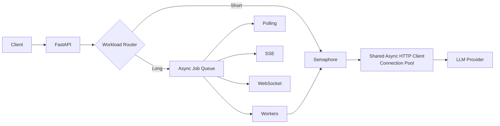
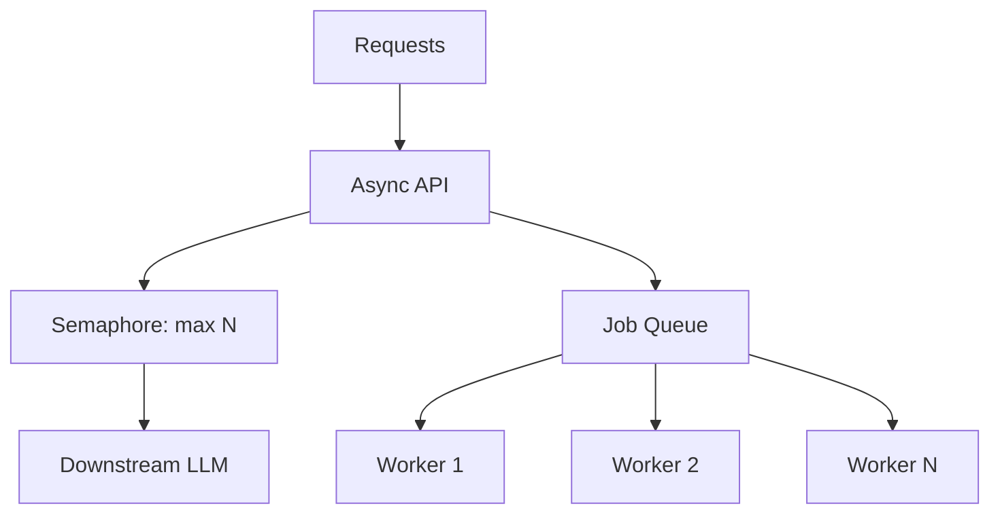

# LLM Backend Performance Lab

> **LLM API 기반 서비스의 비동기 I/O, 동시성 제어, Queue, Connection Pool, Idempotency, Polling/SSE/WebSocket을 직접 구현하고 Before/After 성능을 정량 비교하는 백엔드 엔지니어링 프로젝트**

이 저장소의 목적은 'AI 챗봇 하나 만들기'가 아니다. 외부 LLM이라는 **느리고 제한된 downstream resource**를 가진 백엔드에서 어떤 병목이 발생하고, 서로 다른 해결책의 trade-off를 어떻게 측정하여 선택할지 실험한다.

## Why this project?

단순 구현:
```text
Client → API → LLM → Response
```

이 프로젝트가 다루는 실제 문제:
```text
동시 요청 증가
   ↓
I/O wait / downstream limit
   ↓
p95 증가 / 429 / timeout
   ↓
Async + Connection Pool + Concurrency Control
   ↓
긴 작업 분리 필요
   ↓
Request ID + Queue + Worker
   ↓
Polling / SSE / WebSocket 비용 비교
   ↓
Multi-instance 시 shared state / race condition
   ↓
PostgreSQL / Redis / Kafka의 역할 분리
```

---

## Core Architecture



### Concurrency boundary



---

## Implemented MVP

- [x] FastAPI async application lifespan
- [x] shared `httpx.AsyncClient` connection pool
- [x] blocking `/sync-baseline` endpoint
- [x] end-to-end async `/async` endpoint
- [x] `asyncio.Semaphore` downstream concurrency limiter
- [x] request/job UUID
- [x] bounded in-memory `asyncio.Queue`
- [x] worker pool
- [x] queue wait / processing / total latency model
- [x] Polling Job API
- [x] SSE status stream
- [x] WebSocket status stream
- [x] in-memory idempotency MVP
- [x] PostgreSQL conversation/message schema scaffold
- [x] Redis distributed lock educational adapter
- [x] Kafka event publisher optional adapter
- [x] Locust load-test skeleton
- [x] benchmark CSV → graph generator
- [x] architecture/experiment/interview documentation

### Next Iterations
- [ ] PostgreSQL repository 실제 API 연결
- [ ] Redis-backed job/idempotency store
- [ ] actual retry/backoff/jitter policy
- [ ] Prometheus metrics
- [ ] OpenTelemetry tracing
- [ ] actual connection-reuse experiment
- [ ] actual polling/SSE/WebSocket network-byte experiment
- [ ] multi-instance scale-out
- [ ] Kafka consumers for analytics/evaluation

---

## API

### 1. Blocking baseline

```http
POST /api/v1/chat/sync-baseline
```

```json
{"message":"hello"}
```

### 2. Async chat

```http
POST /api/v1/chat/async
```

```json
{
  "message":"hello",
  "idempotency_key":"demo-001"
}
```

### 3. Long-running Job

```http
POST /api/v1/jobs
```

Response:
```json
{
  "job_id":"...",
  "status":"QUEUED"
}
```

Polling:
```http
GET /api/v1/jobs/{job_id}
```

SSE:
```http
GET /api/v1/jobs/{job_id}/events
```

WebSocket:
```text
ws://localhost:8000/api/v1/jobs/ws/{job_id}
```

---

## Run

### 1. Python

```bash
python -m venv .venv
source .venv/Scripts/activate   # Git Bash / Windows
pip install -r requirements.txt
cp .env.example .env
uvicorn app.main:app --reload
```

Open:
```text
http://localhost:8000/docs
```

기본값은 API key가 필요 없는 `mock` LLM이다. 따라서 성능 실험 구조를 먼저 재현할 수 있다.

### 2. PostgreSQL + Redis

```bash
docker compose up -d postgres redis
```

Kafka까지:
```bash
docker compose --profile kafka up -d
```

---

## Benchmark

Locust UI:
```bash
locust -f benchmarks/locustfile.py --host http://localhost:8000
```

### 주요 지표

| Metric | 의미 |
|---|---|
| Throughput (RPS) | 초당 완료 요청 수 |
| p50 | 중앙 사용자 latency |
| p95 | 95% 요청이 이 시간 안에 완료 |
| p99 | 매우 느린 tail request 관찰 |
| Error Rate | 전체 요청 중 실패 비율 |
| Queue Wait | queue 진입 후 worker가 시작할 때까지 시간 |
| Processing Time | worker 실제 처리 시간 |
| TTFT | 첫 token까지 시간(Streaming 단계) |
| Notification Delay | job 완료 → client가 완료를 인지하기까지 시간 |

---

## SAMPLE Visualization — NOT measured results

> 아래 그래프는 **보고서/분석 파이프라인을 미리 검증하기 위한 synthetic data**다. 실제 성능 수치가 아니다.


실제 실험 후 `benchmarks/results/`의 CSV를 교체하고 같은 분석 스크립트로 다시 생성한다.

---

## Why each technology?

| 문제 | 대안 | 현재 선택 | 이유 |
|---|---|---|---|
| LLM I/O wait | sync / thread / async | Async | I/O-bound workload |
| Downstream 폭주 | unlimited / semaphore / queue | Semaphore | 짧은 요청에 작은 복잡도 |
| 긴 작업 | long HTTP / background job | Queue + Worker | 상태/대기/처리량 분리 |
| 결과 확인 | polling / SSE / WS | 세 방식 비교 | 네트워크 비용을 직접 측정 |
| 연결 생성 비용 | client per request / pool | Shared Pool | keep-alive 재사용 |
| retry 중복 | 무대응 / idempotency | Idempotency | duplicate side-effect 방지 |
| 영구 대화 | browser only / DB | PostgreSQL | source of truth / transaction |
| 다중 서버 임시 상태 | process memory / Redis | Redis 예정 | shared state |
| 분산 coordination | DB lock / Redis lock | 문제별 선택 | lock 남용 방지 |
| event flow | direct call / Kafka | Kafka 선택적 | replay/consumer 분리 필요 시 |

---

## Race Condition: scope matters

```text
CPU        → Atomic / CAS
Thread     → Mutex
Resource   → Semaphore
Database   → Atomic SQL / Transaction / DB Lock
Instances  → DB constraint / Idempotency / Redis Distributed Lock
Events     → Partition + Idempotent Consumer + Deduplication
```

중요한 원칙: **race condition을 발견했다고 바로 Redis distributed lock을 넣지 않는다.** 더 작은 범위의 atomic operation이나 DB constraint로 해결 가능한지 먼저 검토한다.

---

## Documentation

- [Problem Definition](docs/00_problem_definition.md)
- [Architecture Decisions](docs/01_architecture_decisions.md)
- [Race Condition & Concurrency](docs/02_concurrency_and_race_condition.md)
- [Sync vs Async](docs/03_sync_vs_async.md)
- [Queue / Polling / SSE / WebSocket](docs/04_queue_polling_sse_ws.md)
- [Connection Pool](docs/05_connection_pool.md)
- [Persistence & Idempotency](docs/06_persistence_and_idempotency.md)
- [Redis Lock vs Kafka](docs/07_redis_lock_vs_kafka.md)
- [Experiment Plan](docs/08_experiment_plan.md)
- [SAMPLE Performance Report](docs/09_sample_report.md)
- [Interview Questions](docs/10_interview_questions.md)

---

## Portfolio Story

> 초기 blocking LLM API 구조에서 동시 요청 증가 시 발생하는 tail latency와 처리량 문제를 재현하고, end-to-end async, connection pooling, concurrency control을 단계적으로 적용해 Before/After를 비교한다. 이후 장시간 작업을 request-id 기반 queue/worker로 분리하고 Polling·SSE·WebSocket의 네트워크 비용과 notification latency를 정량 비교한다. Multi-instance 확장 단계에서는 PostgreSQL·Redis·Kafka를 각각 영구 정합성, shared coordination, event flow라는 서로 다른 문제에 적용한다.

### Resume one-liner — 결과 측정 전

**FastAPI 기반 LLM 백엔드에서 Async I/O·Connection Pool·Semaphore·Job Queue와 Polling/SSE/WebSocket 전달 방식을 구현하고, 동시 사용자 증가에 따른 throughput·p95 latency·network overhead 비교 실험을 설계**

실제 수치를 얻은 이후에만 `% 개선`, `N배 향상` 표현을 추가한다.

---

## Engineering Principle

> **기술을 많이 쓰는 것이 목표가 아니라, 병목을 측정하고 가장 작은 해결책부터 적용한 뒤 숫자로 선택을 설명하는 것이 목표다.**
