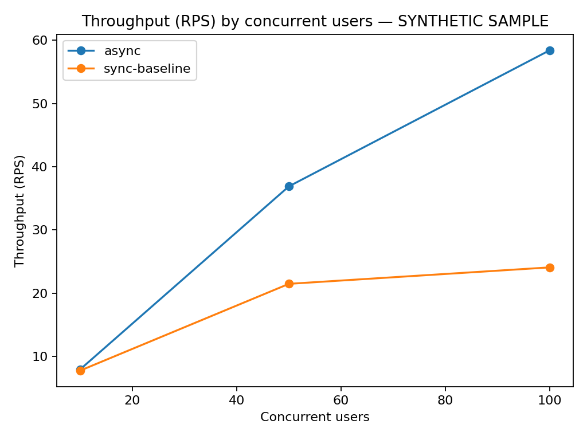
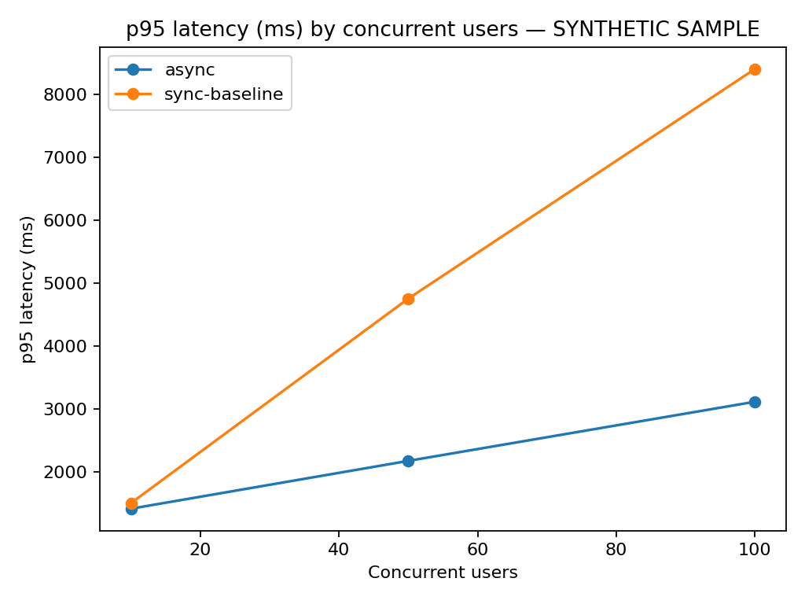
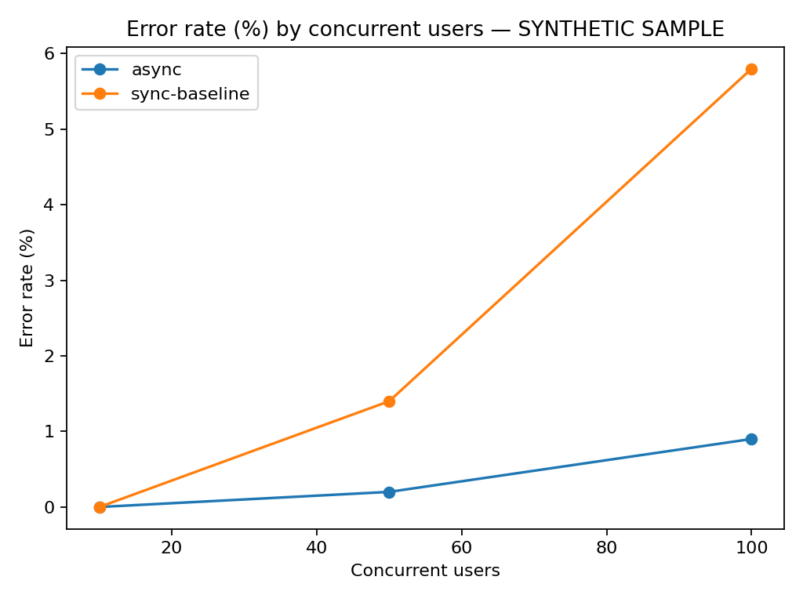

# 예시 성능 보고서

> **주의: 아래 수치는 실제 측정 결과가 아니라 보고서와 그래프 형식을 확인하기 위한 예시 데이터입니다. 실제 포트폴리오 성과로 인용하지 않습니다.**

## 1. 가설

외부 I/O 대기시간을 1.2초로 고정한 모의 부하에서 동시 사용자가 늘어날수록 비동기 방식이 동기식 기준 방식보다 높은 처리량과 낮은 p95 지연시간을 보일 것으로 가정합니다.

## 2. 예시 결과

| 사용자 수 | 방식 | 처리량(RPS) | p95(ms) | 오류율(%) |
|---:|---|---:|---:|---:|
| 10 | 동기 | 7.8 | 1510 | 0.0 |
| 10 | 비동기 | 8.0 | 1420 | 0.0 |
| 50 | 동기 | 21.5 | 4760 | 1.4 |
| 50 | 비동기 | 36.9 | 2180 | 0.2 |
| 100 | 동기 | 24.1 | 8410 | 5.8 |
| 100 | 비동기 | 58.4 | 3120 | 0.9 |

## 3. 예시 해석

동시 요청이 적을 때는 두 방식의 차이가 작지만, 동시 사용자가 늘어날수록 동기 방식의 느린 요청 구간이 빠르게 증가하는 모습을 가정한 예시입니다. 비동기 방식은 I/O 대기 중 다른 요청을 진행할 수 있기 때문에 예시 데이터에서는 더 높은 처리량을 보입니다.

하지만 이 결과만으로 **“비동기가 항상 몇 배 빠르다”**고 결론 내릴 수 없습니다. FastAPI 작업자 수, 스레드 풀, 외부 서비스 처리 한계, 연결 풀, 세마포어 값에 따라 결과가 달라질 수 있습니다.

## 4. 실제 실험 후 기록할 내용

- 예시 문구 제거
- 실제 실행 환경
- 3회 이상 반복 결과
- Locust 원본 CSV
- p50 / p95 / p99
- CPU / 메모리
- 429 및 장애 로그
- 결과 해석과 선택 이유

## 그래프

